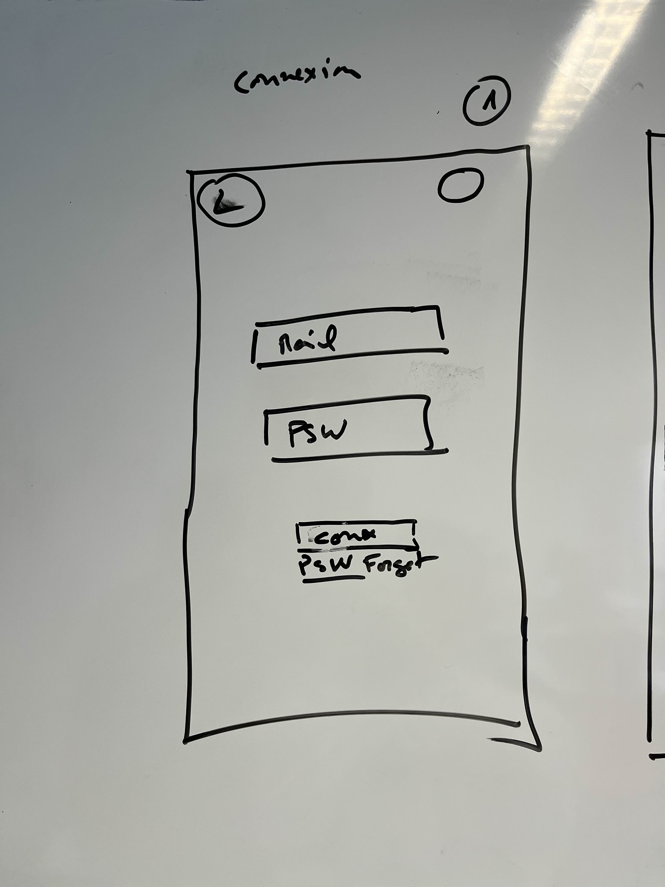
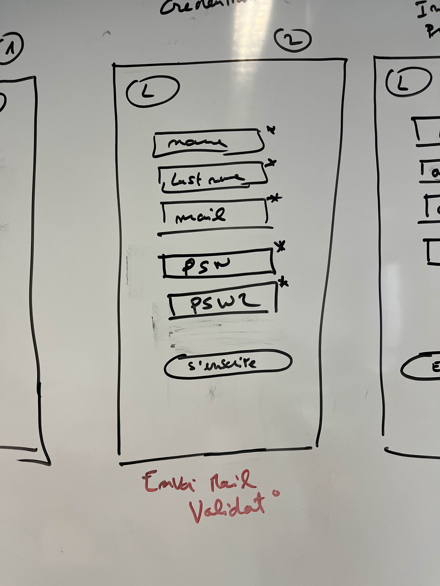

# cartographie des requêtes/cas d’utilisation

cartographie des requêtes 

table : user

Requête : Get→ user

**cas d’utilisation :**

- en tant qu’utilisateur je vais pouvoir me connecter
- en tant qu’utilisateur je vais pouvoir m’inscrire,
- en tant qu’utilisateur je vais pouvoir refaire mon mot de passe si je l’ai oublié

post → user/{name, lastname, mail, psw(bcrypt sha2048)

- admin status boolean = 1 DEPUIS PAGE 2, admin status boolean = 0 DEPUIS PAGE 8. donc 2 lien different. 

 - endpoint différent de la page 2 pour user: users/employee/{name, lastname, mail, psw(bcrypt sha2048)

cas d’utilisation: 

- En tant que utilisateur je veux m’inscrire (en tant que admin).

table: company

post → company {tel, cde postal, country, peut être même un nom de company}

- cas d’utilisation: en tant que utilisateur je voudrait me renseigner mon entreprise (company)

table: farm la pos

Ajouter un ferme rediriger vers un page 5 POST
Cliquant sur une ferme rediriger vers page 6 avec un requête GET

Cas d’utilisation: 

- en tant que utilisateur je voudrait la possibilité de supprimer des fermes(dans la page 8)
- en tant que utilisateur je voudrait la possibilité de ajouter mes fermes.

Post → {fruits, legumes (plusieurs possibles), identifiant avec le kit pour localiser tout le materiel, code postal pour connecte a un api meteo, luminosite etc..}

Tables: matériel, Récolte,kit

cas d’utilisation : 

- En tant qu’utilisateur: je pouvoir renseigner mes cultures,
- En tant qu’utilisateur je pourrais renseigner le kit matériel
- En tant qu’utilisateur je pourrais localiser ma ferme

²Get→ tables : Recolte, Kit, Farm, iot **(Voir avec Jack pour double BDD) table photo**

cas d’utilisation: 

- En cas de utilisation je voudrais accéder aux images des caméra pour la suivaillance de mes culture.
- En cas de utilisation  je voudrais l’option de voir l’information des sensors
- En cas d’utilisation je voudrais l’option de regarder les errors. (FOOTER GLOBAL ET NOTIFACTIONS TELEPHONE POUR LES ERRORS) .

get → iot (pour graph),
get → api pour infos précise et journalière/hebdo

get → paramètres (enregistres les paramètre du matériel)

cas d’utilisation: 

- en tant qu’utilisateur je vais pouvoir avoir accès a un graphique en rapport avec le widget (température, taux d’humidité dans l’air, irrigation…)
- en tant qu’utilisateur je vais pouvoir avoir plus de détail sur les informations ayant un rapport avec le widget
- en tant qu’utilisateur je vais pouvoir avoir accès a une prévision journalière / hebdomadière
- en tant qu’utilisateur je vais pouvoir modifier mes appareils via les paramètres

modification des chose (uniquement pour l’admin): 
Get/Post/delete/update→ user avec boolean 0 (utilisateurs) qui on que accès aux fermes (peux pas supprimer)

Get/Post/delete/update → compagnie (si on ajoute ca renvoie vers le page 4, on peux aussi supprimer des compagnie ou éditer/mettre a jour)  

Get/Post/delete/update → farm (pour le suppression ou modification)

L’option admin ne s’affiche uniquement que pour les admins

cas d’utilisation:

- en tant qu’utilisateur je vais pouvoir modifier mes appareils via les paramètres
- en tant qu’utilsateur je voudrait l’option de ajouter des fermes
- en tant qu’utilsateur je voudrat l’option de supprimer mes fermes
- en tant qu’utilsateur je voudrait l’option de modifier mes fermes
- en tant qu’utilsateur je voudrait l’option de ajouter d’autres utilisateurs
- en tant qu’utilsateur je voudrait l’option de suprimer d’autres utilisateurs
- en tant qu’utilsateur je voudrait l’option de modifier d’autres utilisateurs
- en tant qu’utilsateur je voudrait l’option de modifier l’information pertinent au compte
- en tant qu’utilsateur je voudrait l’option de modifier la langue principal de l’application